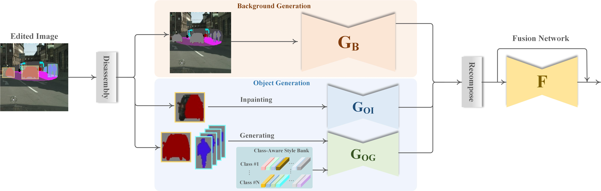
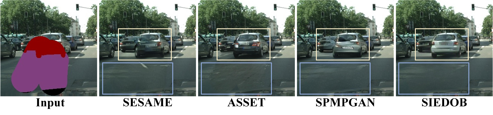

## SIEDOB: Semantic Image Editing by Disentangling Object and Background

CVPR 2023 (highlight paper) 
[[Paper]](https://openaccess.thecvf.com/content/CVPR2023/papers/Luo_SIEDOB_Semantic_Image_Editing_by_Disentangling_Object_and_Background_CVPR_2023_paper.pdf)

Semantic image editing provides users with a flexible tool to modify a given image guided by a corresponding segmentation map. In this task, the features of the foreground objects and the backgrounds are quite different. However, all previous methods handle backgrounds and objects as a whole using a monolithic model. Consequently, they remain limited in processing content-rich images and suffer from generating unrealistic objects and
texture-inconsistent backgrounds. To address this issue, we propose a novel paradigm, **S**emantic **I**mage **E**diting by **D**isentangling **O**bject and **B**ackground (**SIEDOB**), the core idea of which is to explicitly leverages several heterogeneous subnetworks for objects and backgrounds.

Our method can well handle dense objects overlapping each other and generate texture-consistent background. 

### Requirements

- The code has been tested with PyTorch 1.10.1 and Python 3.7.11. We train our model with a NIVIDA RTX3090 GPU.

## Training
Here, let's take Cityscapes dataset as an example.

### Dataset Preparation
Download the original dataset [Cityscapes](https://www.cityscapes-dataset.com/). Create folder `data/dataset_name/` with subfolders `train/` and `test/`. `train/` and `test/` should each have their own subfolders `images/`, `labels/`, `inst_map/`.
- `images/`: Original images.
- `labels/`: Segmentation maps.
- `inst_map/`(optional): Instance maps for generating edge maps. We find edge maps only have a slight impact. If there is no instance map, it can be omitted or replaced with segmentation map.

We include some examples in `data/`, so you can run the training without preparing the dataset. `data/predefined_mask/` contains pre-generated mask maps for testing.

